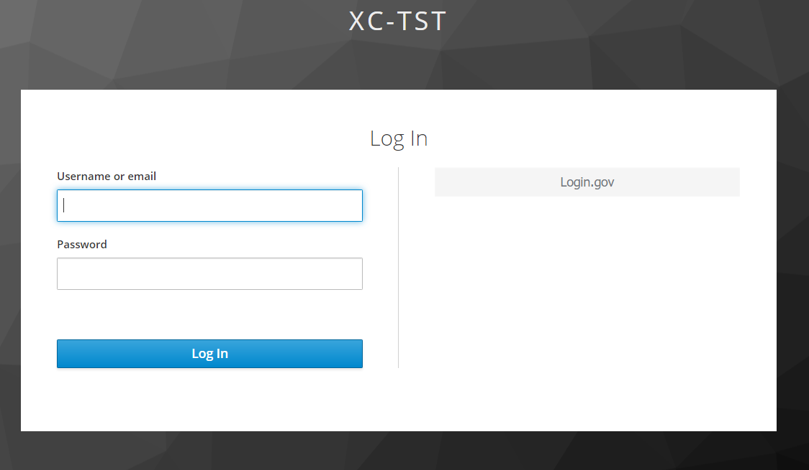
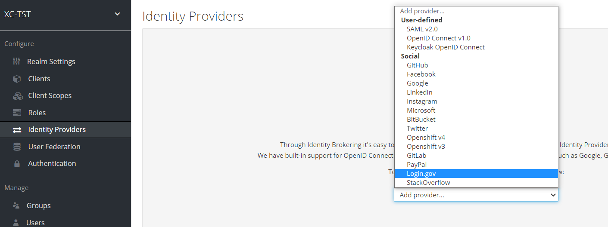
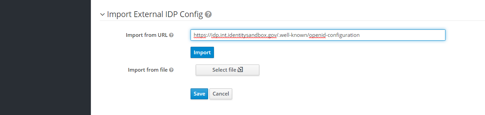
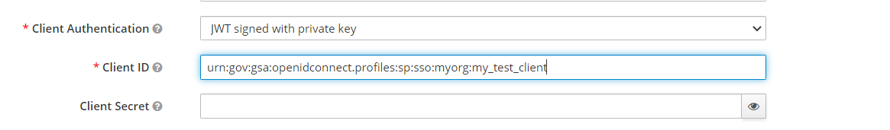
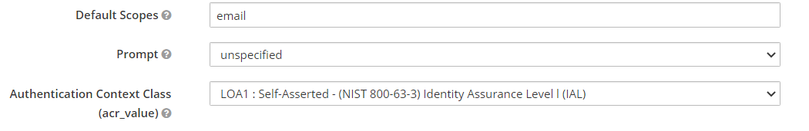

# Keycloak-Login_gov-IdentityProvider

## About
The software enables users of Keycloak (a modern open source identity and access management solution) to easily integrate with login.gov as an identity provider.

After configuring this plugin the standard Keycloak Browser Flow will show the "login.gov" authentication option.




## Configuration
Users will need to configure a Keycloak Identity Provider as well as OIDC client configuration in login.gov.

### Keycloak

 1. Compile the plugin src by running ```mvn clean package```

 2. Drop the ```login_gov-<VERSION>.jar``` file in the ```keycloak-<VERSION>\standalone\deployments``` directory

 3. Create or choose a target Keycloak realm and click the `Identity Providers` tab, click the `Add provider...` option and select `Login.gov`


 4. At the bottom of the page paste the login.gov oidc well-known URI and `Import`
 

 5. Continue to configure the Identity Provider properties for `Client Authentication` and `Client ID` as follows.

`Default Scopes` and `Authentication Context Class`


 6. Click `save` at the bottom
 
### login.gov
See configuration docs for [login.gov](https://developers.login.gov/oidc/) oidc clients.

 1. The `Issuer` field will be set to `Client ID` value in Keycloak login.gov Identity provider.

 2. Keycloak JWT X.509 certificate must be configured on the login.gov oidc client's `Public Certificate` field.  

    Get the X.509 certificate from:
    ```
    https://{{Keycloak_Host}}:{{Keycloak_Port}}/auth/realms/{{Realm_Name}}/protocol/openid-connect/certs
    ```

    Find the `x5c` property in the json response and copy the first string in the array.

 3. Make sure to set the `Authentication Context Class (acr_value)` to match what is set in keycloak:
 * LOA1 :  Self-Asserted - (NIST 800-63-3) Identity Assurance Level l (IAL) (default)
 * LOA3 :  Proofed  - (NIST 800-63-3) Identity Assurance Level 2 (IAL)


## Pull Requests

This software was developed at the National Geospatial-Intelligence Agency (NGA) in collaboration with Arrona Tech, LLC under subcontract to Alion, Inc. The government has "unlimited rights" and is releasing this software to increase the impact of government investments by providing developers with the opportunity to take things in new directions. The software use, modification, and distribution rights are stipulated within the Apache 2.0 license.

If you'd like to contribute to this project, please make a pull request. We'll review the pull request and discuss the changes. All pull request contributions to this project will be released under the Apache license.

Keycloak is open sourced under the Apache 2.0 license. 

https://github.com/keycloak/keycloak
